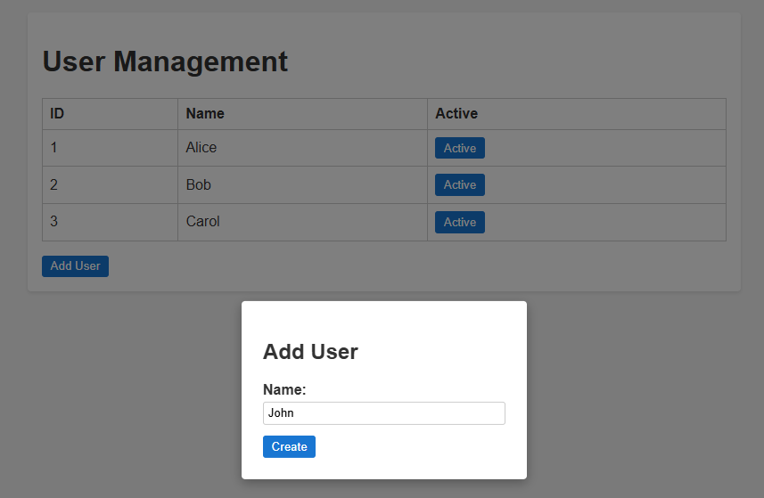

# User Management App

A simple Angular application for managing a list of users with basic CRUD operations and state management via Akita.



# 🚀 Features

Display Users: View a table of users showing ID, Name, and Active status.

Add User: Open a modal dialog to create a new user by entering a name.

Update Status: Toggle a user’s active state between Active and Inactive directly in the table.

Delete User: Remove a user entry from the table with a single click.

# ⚙️ Technology Stack

Framework: Angular CLI

State Management: Akita

Reactivity: RxJS

UI: Bootstrap for styling and modals

Language: TypeScript

# 💻 Getting Started

Clone the repository

```bash
git clone https://github.com/AndrewT9/4createUserTable.git
```

```bash
npm install
```

```bash
ng serve
```

Navigate to http://localhost:4200 in your browser.

# 🛠 Usage

Use Active/Inactive buttons to toggle user status.

Click Add User to open the modal and create a new user.

User mustn't duplicate.
